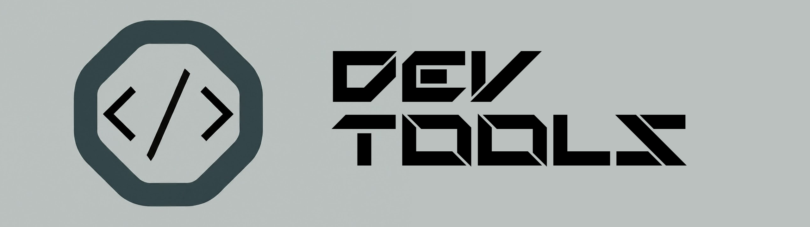

## Tabla de contenidos: DEVTOOLS

Este repositorio es una copilación de proyectos y herramientas, para el desarrollo tanto frontend como backend.

> *Programadores: Una maquina que convierte cafe en codigo. — Un loquito a las 3:00AM*

It's a great way to learn.

- [Tabla de contenidos: DEVTOOLS](#tabla-de-contenidos-devtools)
- [Herramientas](#herramientas)
    - [`Iconos`](#iconos)
    - [Sin categoria](#sin-categoria)
- [Contribuir](#contribuir)

## Herramientas

#### `Iconos`

* [**Fontawesome**: _Font Awesome es la biblioteca de iconos y el conjunto de herramientas de Internet, utilizada por millones de diseñadores, desarrolladores y creadores de contenido._](https://fontawesome.com/)
* [**Bootstrap Icons**: _Biblioteca de iconos gratuita, de alta calidad y de código abierto con más de 2000 iconos. Inclúyelos como quieras: SVG, sprites SVG o fuentes web. Úsalos con o sin Bootstrap en cualquier proyecto._](https://icons.getbootstrap.com/)
* [**Google Icons** _Material Symbols son nuestros íconos más nuevos y consolidan más de 3276 glifos en un solo archivo de fuente con una amplia gama de variantes de diseño._](https://fonts.google.com/icons)
* [**Fluent Icons**: _Iconos de código abierto de Microsoft._](https://fluenticons.co//)
* [**Heroicons**: _Hermosos íconos SVG hechos a mano por los creadores de Tailwind CSS._](https://heroicons.com/)
* [**Flowbite Icons** _Comience con una colección de 521 íconos SVG gratuitos y de código abierto compatibles con Flowbite y Tailwind CSS basados en estilos sólidos y de contorno con soporte para React (JSX) y Figma._](https://flowbite.com/icons/)
* [**Free Icons**: _This repository provides a collection of over 23,000 high-quality icons that you can use freely in your design projects._](https://free-icons.github.io/free-icons/)
* [**Huge Icons**: _Biblioteca de íconos de primer nivel diseñada por expertos. Diseñe y cree con Hugeicons Pro, la hermosa biblioteca de íconos para la innovación._](https://hugeicons.com/)

#### Sin categoria

* [**Yet Another Minifier**: _Un minificador de código y documentos JS y CSS para optimizaciones._](https://mendozanicolas.github.io/yet-another-minifier/)
* [**YopMail**: _Generador de correos electronicos temporales para testing_](https://yopmail.com/es/)

## Contribuir
* Las recomendaciones son bienvenidas, solo manda una PR, o [crea un issue](https://github.com/MendozaNicolas/dev-tools/issues/new)
* Ayudame revisando las [issues pendientes](https://github.com/MendozaNicolas/dev-tools/issues) dejando comentarios y "reacciones"

